# Halsu Plugins for Streaming

| [Halsu HybridKeyer](#halsu-hybridkeyer) | [Halsu AlphaTools](#halsu-alphatools) | [Halsu Relightwrap](#halsu-relightwrap) |

A collection of third-party tools and filters for OBS Studio.

## System Requirements

**Platform**: Windows only (64-bit)

**Tested Configuration**: HD footage on 128GB RAM / RTX 4090

> [!WARNING]
> Some effects are compute-intensive at high settings. Performance may vary depending on your hardware, resolution, and settings. Start with lower quality/radius values and increase as needed.

---

## Download

**📦 [Halsu_PluginsForStreaming_20260206.zip](Halsu_PluginsForStreaming_20260206.zip)** - Combined installer with all three plugins

Individual installers:
- [Halsu_Relightwrap_Installer.zip](Halsu_Relightwrap_Installer.zip) - v0.4.0
- [Halsu_HybridKeyer_Installer.zip](Halsu_HybridKeyer_Installer.zip) - v0.28.1
- [Halsu_AlphaTools_Installer.zip](Halsu_AlphaTools_Installer.zip) - v0.2.0

---

## Halsu HybridKeyer

| Version 0.28.1 |

A hybrid RGB/YUV chroma- and luma-keyer with spill suppression, shadow extraction, reference-based correction, and advanced edge handling. The plugin exposes low-level controls for technical users, but is designed to give usable results with minimal adjustment.

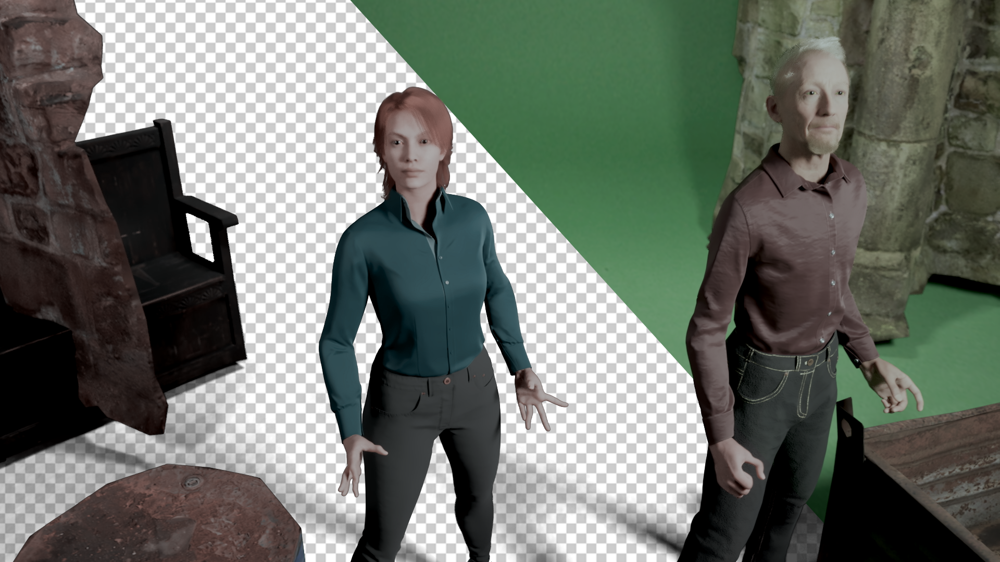

---

## Quickstart (for most users)

1. Select the **Key Color** (the greenscreen / backdrop color).
2. Adjust **Matte White** until the foreground subject is fully opaque.
3. Adjust **Matte Black** until the background is fully transparent.
   
If the result looks good at this point, you are done.

If the foreground cannot be made fully opaque, slightly adjust **Prekey Despill**.  
If the background will not fully disappear, slightly adjust **Prekey Saturate**.

A little is a lot. After changing prekey settings, you will need to revisit Matte White and Matte Black. These controls are sufficient for decent results in most setups.

Everything below is optional fine-tuning.

---

## Settings (Top to Bottom)

### Key Color

The backdrop color to be keyed out. If the color is not pure green shade, the hue will be rotated so that it is. This affects the keying operations, but not the final output.

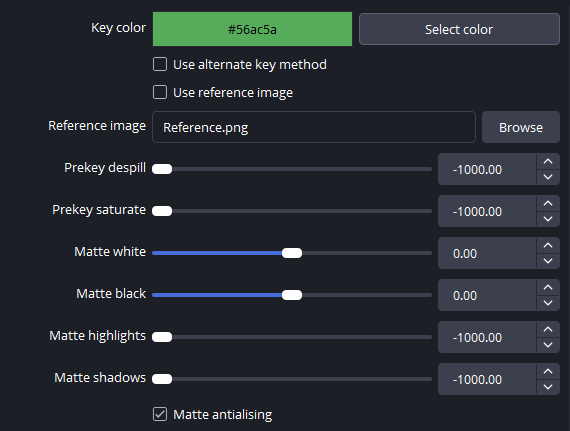

---

### Alternate Key Method

Switches from RGB difference (Vlahos-style) keying to a pure chroma key in YUV color space. This may yield better result in some difficult cases. Requires new adjustments for at least matte white and matte black, often other settings too.

---

### Reference Image (Empty Screen Grab)

A capture of the empty greenscreen used as a reference for the key. Particularly useful for pulling good key with uneven lighting or wrinkled backdrop. Requires a static camera for proper operation.

---

### Prekey Despill

Tints the image towards magenta before keying. Useful when reflected green spill light from the backdrop contaminates the subject (e.g. black clothes have become dark green). Affects only the matte creation (transparency).

---

### Prekey Saturate

Increases color saturation before keying. Usually used in combination with prekey despill, which tends to desaturate the greenscreen. Affects only the matte creation (transparency).

---

### Matte White

Controls foreground opacity. Adjust to find the sweet spot where the subject has just become solid but not more.

---

### Matte Black

Controls background transparency. Adjust to find the sweet spot where the background has just become transparent but not more.

---

### Highlights and Shadows (Luma Key)

Allows bright or dark areas to be keyed using luminance. Can be useful for e.g. fine strands of blonde hair, or deep shadows that have a lot of spill.

---

### Matte Anti-Aliasing

Attempts to smooth jagged edges caused by chroma subsampling, at the cost of less fine details, and a possible need to adjust matte offset. 

---

### Shadow Color & Intensity

Adds luma-keyed shadows of a user-defined color. Intended for separate control of the key just for shadows. Crop sliders can be used to isolate the area where shadows will appear.

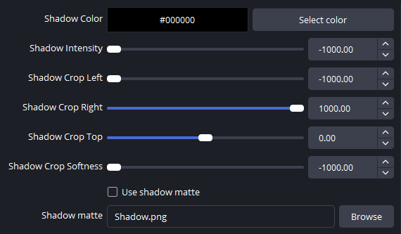

---

### Shadow Matte Image (B/W)

Limits where custom shadow extraction is applied.

---

### Spill Reduction

Controls the strength and algorithm of spill suppression. Green channel is compared (in order of strength) to the maximum, a mix, and the minimum of red and blue channels.

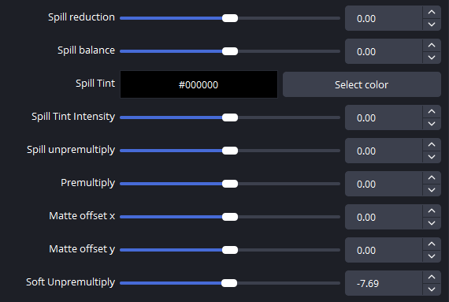

---

### Spill Balance

Adjusts which colors are affected by spill reduction - adjust to better retain yellows or turqoises. Applies mostly at medium spill reduction strength, when a mix of red and blue is used for spill comparision.

---

### Spill Tint

Tints areas thet have green spill or transparency towards user-selected color. Usage is similar to light wrap tools, helps the foreground blend better with the scene. 

---

### Spill Unpremultiply

Attempts to remove backdrop color from semi-transparent areas.

---

### Premultiply

Controls brightness of semi-transparent areas by multiplying (or dividing, depending on setting) luminance by alpha. Useful for controlling edge brightness. The default setting is "mathematically correct" but adjusting this may help getting visually better results.

---

### Soft Unpremultiply

Performs unpremultiplication/premultiplication based on alpha **before** matte level adjustments. Often produces smoother, more natural visual results, but may also affect opaque areas.

---

### Garbage Matte Image (B/W)

Masks out unwanted regions. Black areas will be set transparent, white areas will go through the keying process.

---

### Inside Matte Image (B/W)

Forces white regions to be opaque. Can be used to retain green plants, reflective objects etc., as long as they are stationary. Option to skip spill removal.

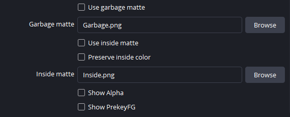

---

### Preview Options

Various debug and preview modes to help visualize different processing stages.

---

## Usage Notes

This plugin is not an automatic or AI-based keyer.  
Most controls exist to fix specific problems, not to improve an already good key.

If your image looks acceptable, stop adjusting settings.

---

## Installation

1. Close OBS Studio if it's running
2. Extract this ZIP file
3. Copy the contents to your OBS installation folder:
   - Windows: C:\Program Files\obs-studio\
   - The folder structure should merge with existing folders

## Files Included

- obs-plugins/64bit/Halsu_HybridKeyer.dll
- data/obs-plugins/Halsu_HybridKeyer/Halsu_HybridKeyer.effect

## Usage
* Open OBS Studio
* Right-click a source -> **Filters**
* Click **+** -> **Halsu HybridKeyer**

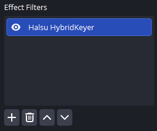

---
| [Halsu HybridKeyer](#halsu-hybridkeyer) | [Halsu AlphaTools](#halsu-alphatools) | [Halsu Relightwrap](#halsu-relightwrap) |

## Halsu AlphaTools

| Version 0.2.0 |

An alpha channel utility for refining mattes directly in OBS. Features alpha expansion, blurs, and separable median filters to clean up noisy edges or fill holes in keys. Multiple instances of the filter can be combined to create advanced effects, for example, first expanding and then shrinking the alpha by the same amount can fill small holes in the foreground (and the opposite can be used to clean up noise from transparent areas).

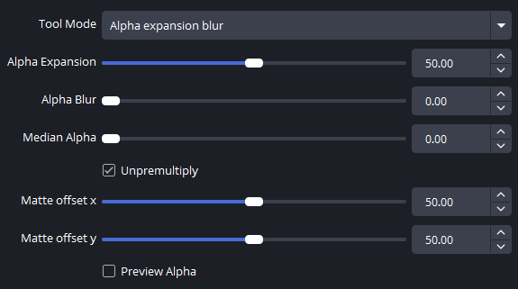

---

## Quickstart (AlphaTools)

1. Select the desired **Tool Selection** mode (e.g., Alpha expansion blur).
2. Adjust **Alpha Expansion** to choke or dilate the edge.
3. Use **Alpha Blur** or **Median Alpha** to smooth out artifacts or noise.

---

## Settings (AlphaTools)

### Tool Selection

Selects the active processing mode. 

- **Alpha expansion**: Pure erosion/dilation of the alpha channel.
- **Alpha expansion blur**: Combined expansion and blurring for smooth edge adjustments.
- **Alpha blur**: Pure Gaussian-style blur for soft edges.
- **Alpha Median**: Performance-optimized separable median filter for removing "salt and pepper" noise from edges.

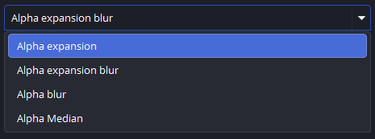

---

### Alpha Expansion

Standard choke/dilate control. 
- **Higher values**: Dilates (expands) the alpha matte.
- **Lower values**: Erodes (shrinks) the alpha matte.

---

### Alpha Expansion Blur

Softens the alpha channel. Use this to blend sharp key edges into the background for a more natural look. The blur is limited to the expanded / dilated alpha bounds.

---

### Alpha Blur

Softens the alpha channel. The blur is not limited to alpha bounds, and may thus crete an outside halo.

---

### Median Alpha

A spatial filter that removes isolated pixels or small holes without blurring the entire edge. Used e.g. for cleaning up noisy chroma keys.

---

### Unpremultiply

When enabled, the plugin attempts to remove background color contamination from semi-transparent edges before applying effects, then re-premultiplies after.

---

### Matte Offset (X/Y)

Allows for sub-pixel spatial shifting of the alpha matte relative to the RGB image. Useful for correcting slight alignment issues in keys.

---

### Preview Alpha

Forces the output to display only the processed Alpha channel as a grayscale image. Essential for fine-tuning matte controls.

---

## Usage
* Open OBS Studio
* Right-click a source -> **Filters**
* Click **+** -> **Halsu AlphaTools**

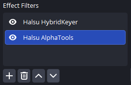

---

## Support
If you encounter any issues or have feature suggestions, please [open an issue](https://github.com/Halsu/halsu-plugins-for-streaming/issues) on GitHub.

---

## Known Issues

**OBS color space management with custom shaders**

If the colors look wrong after loading the plugin (especially with 10-bit sources), add a native **Color Correction** filter before the plugin. No changes to the Color Correction filter are needed — just adding it resolves the issue.

**Color picker alpha initialization**

Color pickers may appear transparent in the UI on first load. The colors still work correctly — just pick your desired color and the effect will apply.

---

| [Halsu HybridKeyer](#halsu-hybridkeyer) | [Halsu AlphaTools](#halsu-alphatools) | [Halsu Relightwrap](#halsu-relightwrap) |

## Halsu Relightwrap

| Version 0.4.0 |

A light wrap and directional edge relighting tool for compositing keyed footage, or other material with an alpha channel. Simulates light bouncing from the background onto the foreground subject, creating natural-looking integration. Features custom wrap colors, directional lighting with surface detail analysis, multiple blend modes, and an erosion-based defringe algorithm for cleaning up color fringing / matte lines on transparent edges.

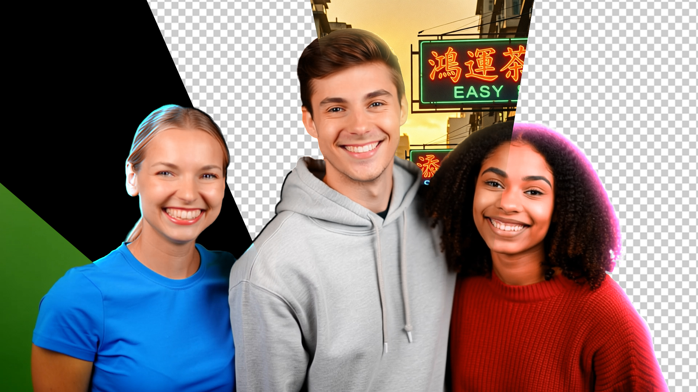

---

## Quickstart (Relightwrap)

1. Adjust **Custom Wrap Color** to your liking
2. Adjust **Wrap Strength** to control the intensity of the light wrap (default 100 gives immediate visible results).
3. Adjust **Wrap Width** to control how far the wrap extends into the foreground.

These controls are sufficient for basic light wrap.

---

## Settings (Relightwrap)

### View

Preview mode selector for debugging and fine-tuning:
- **Final Result**: Foreground with lightwrap applied
- **Original Foreground**: Input without any processing
- **Wrap Fill**: The light wrap effect isolated
- **Comp**: Foreground with light wrap applied, composited on top of selected background image
- **Mask**: The luma-based application mask
- **Direction Debug**: Visualizes the directional lighting calculation
- **LightWrap Preview**: Shows the wrap before blending
- **Surface Detail**: Displays the bump/surface analysis

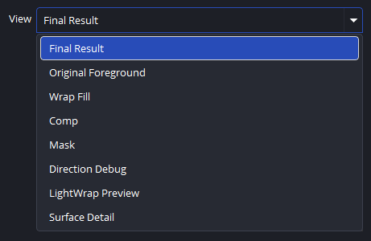

---

### Apply To

Controls which tonal range receives the light wrap effect:
- **All**: Applies to the entire image
- **Highlights**: Only bright areas
- **Highlights/Mids**: Bright and mid-tone areas
- **Shadows**: Only dark areas

Useful for targeting specific parts of the subject, e.g., applying wrap only to shadow areas for subtle integration.

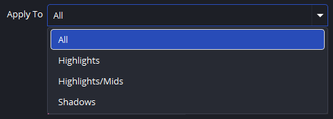

---

### Wrap Source

Selects the source for the light wrap color:
- **Background Image**: Samples colors from a loaded background image. 
- **Custom Color**: Uses a user-defined color for stylized looks or when you don't have a background plate.

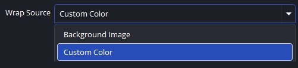

---

### Background Image

Path to the background image file (active when Wrap Source is set to "Background Image"). The plugin will extract colors from this image to create realistic light wrap that matches your scene. For proper operation the background image needs to be blurred beforehand. For HD size, blur of around 30 pixels is a good starting point.

---

### Custom Wrap Color

The color used for light wrap when Wrap Source is set to "Custom Color". Default is pink for immediate visibility, but can be adjusted to match your scene's lighting (e.g., warm orange for sunset, cool blue for daylight). Or to whatever for wilder effects.

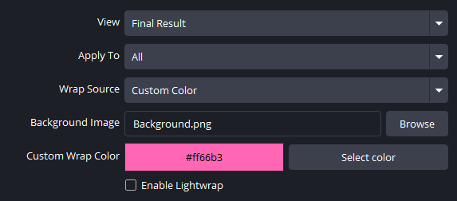

---

### Wrap Strength

Controls the overall intensity of the light wrap effect. Range 0-100, where:
- **0**: No wrap effect
- **100**: Full strength (default)

Adjust to your liking - for natural look that blends the subject to background, adjust to the point where you notice the effect, then dial back a little. 

---

### Wrap Width

Controls how far the light wrap extends into the foreground subject. Higher values create a wider, more diffuse wrap; lower values keep it tight to the edges.

---

### Wrap Falloff

Controls the gradient falloff of the wrap effect - whether it diminishes steadily over whole width, or reduces sharply from the edge with a long tail.

---

### Blend Mode

Compositing method for applying the light wrap:
- **Add**: Brightens strongly, may cause overexposure
- **Screen**: Soft brightening, preserves highlights (Default)
- **Overlay**: Contrast-aware blending
- **Lighten**: Only affects darker areas, replacing them with wrap color
- **Mix**: Linear interpolation / crossfade
- **Darken**: Only affects brighter areas, replacing them with wrap color
- **Multiply**: Darkens (useful for blending over dark backgrounds)

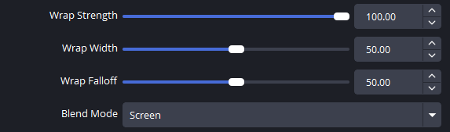

---

### Relight Blend

Controls the mix between the traditional lightwrap effect (using the controls above) and a relight blending method, where the foreground is color corrected to tint towards the wrap color. The latter is a good starting point for a semi-realistic edge relight effect.

---

### Bump Strength

Controls the intensity of surface detail analysis for directional relighting. Higher values make the lighting more responsive to surface variations (wrinkles, folds, etc.).

---

### Multiply By FG Luma

Modulates the wrap effect by the foreground's luminance. Can sometimes cause a more natural blend. Use to taste.

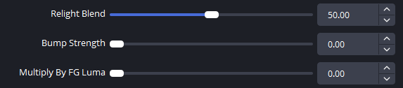

---

### Light Angle

Direction of the simulated light source in degrees (-180 to 180). Match this to your scene's key light direction for realistic integration.

---

### Light Range

Angular range of the directional lighting effect (1-180 degrees). Lower values create a more focused, directional light; higher values create a more diffuse, ambient effect.

---

### Light Quality

Controls the sampling quality for directional lighting. Higher values produce smoother results but may impact performance. Start at 0 and increase only if you see banding or artifacts.

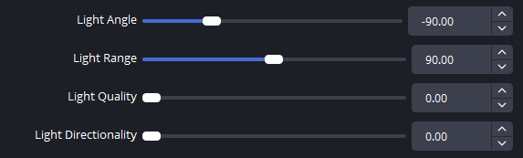

---

### Light Directionality

Blends between omnidirectional (0) and fully directional (100) lighting. At 0, light wraps from all directions equally; at 100, it only wraps from the specified light angle.

---

### Enable Defringing

Activates the erosion-based defringe algorithm to remove chromatic aberration and color fringing from semi-transparent edges. Particularly useful for cleaning up edges from keyers. Can save a shot - or ruin it. Use carefully, only when needed. 

**Performance**: The defringe algorithm is computationally intensive. Disable it when not needed, or reduce the search radius for better performance.

---

### Defringe Distance

Controls the erosion distance for detecting core vs. edge pixels (0-100). Higher values treat more of the edge as "fringe" that needs correction. Start low and increase until fringing disappears. High values can be intensive to calculate.

---

### Defringe Search Radius

Maximum distance to search for a clean "core" pixel color when correcting fringe (0-100). Higher values can fix wider fringe halos but may introduce color from distant areas - and they too can be VERY intensive to calculate. You have been warned. After setting defringe distance, start with a very low value, and increase until fringing is gone, no more.

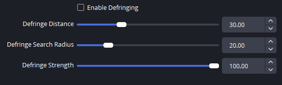

---

### Defringe Strength

Opacity of the defringe correction (0-100). At 100 (default), the fringe is fully replaced with the core color; at 0, no correction is applied. Reduce if the defringing is too aggressive to find an acceptable compromise.

---

## Usage Notes (Relightwrap)

**Light wrap is a finishing touch**, not a fix for bad keys. Apply it after your keying and matte refinement are complete.

**Match your scene**: The light angle, color, and intensity should match your background plate for realistic results.

**Defringe is optional**: Only enable it if you see color fringing on edges. Most clean keys won't need it.

**Layering**: For complex looks, consider using multiple instances with different settings (e.g., one for highlights, one for shadows). Also, you may wish to defringe with a separate instance before applying light wrap.

---

## Installation (Relightwrap)

1. Close OBS Studio if it's running
2. Extract this ZIP file
3. Copy the contents to your OBS installation folder:
   - Windows: C:\Program Files\obs-studio\
   - The folder structure should merge with existing folders

## Files Included

- obs-plugins/64bit/Halsu_Relightwrap.dll
- data/obs-plugins/Halsu_Relightwrap/Halsu_Relightwrap.effect

## Usage

* Open OBS Studio
* Right-click a source -> **Filters**
* Click **+** -> **Halsu Relightwrap**

---

## AI Disclosure & Licensing

**License**  
GPL v2.0  
Source code: [Halsu_AlphaTools/](Halsu_AlphaTools/), [Halsu_HybridKeyer/](Halsu_HybridKeyer/), [Halsu_Relightwrap/](Halsu_Relightwrap/)

**AI Disclosure**  
Core shader logic and design were hand-coded by Halsu. AI tools were used for some shader features, C++ boilerplate, and build infrastructure.

**Affiliation**  
This is a third-party plugin and is not affiliated with the OBS Project.
